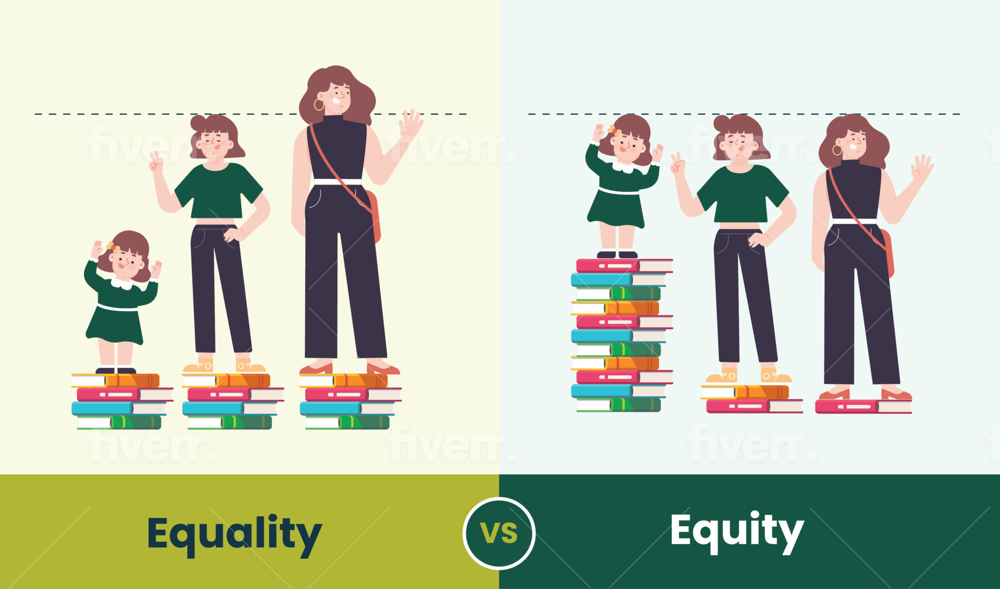

# Course Reading Two

<!-- - In the lecture of Design for Ethics we learnt about equity and equality and that equality does not necessarily help in all situations. -->
- One interesting point was Jake Sticca's question about whether it's beneficial to code anything as masculine or feminine, as this creates a hierarchy. This made me think differently about how we might unconsciously gender certain aspects of engineering work or roles, potentially limiting opportunities or creating biases.
- The biggest takeaway for engineers is the importance of actively promoting gender equality and challenging traditional gender norms in the workplace. This not only benefits individual engineers but also leads to better business results, more innovation, and positive societal impacts.
- Design was taught during the Design for equity class.

<!-- In the Paulette Senior explicitly mentions this difference, saying "So in order to get to equality, we need to do that and understand principles of equity." This aligns with the design ethics perspective that equality (treating everyone the same) is not always sufficient, and equity (giving people what they need to be successful) is often necessary.

Engineers should consider how they can contribute to creating more inclusive and equitable work environments and how their designs and projects can promote gender equality in society at large. -->

<!-- image: ../../static/Equity-vs-Equality_Cartoon-2048x1208.jpg -->

::right::

  

  <a class="text-right" link="https://millennialcities.com/equity-vs-equality-using-tools-to-explain-the-difference/">Source</a>

<!-- <https://podcasts.apple.com/ca/podcast/myth-gender-equality-only-benefits-women/id1588965394?i=1000537656572> -->
