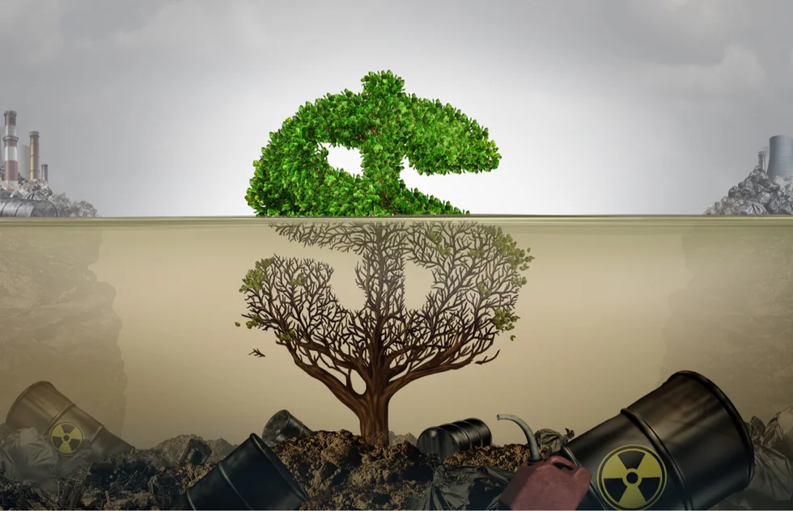

# Course Reading One

<!-- Recommended Reflection -->

[Image by Futerra](https://www.wearefuterra.com/blog/what-is-greenhushing-and-is-it-worse-than-greenwashing)

::right::

- An investigation was done on IKEA's sourcing practices and this lead to a troubling issue between the company's sustainability claims and its actual practices, one regarding illegal logging in protected Siberian forests.
- IKEA despite marketing itself as a leader in sustainable furniture, having been linked to sourcing it timber linked to significant environmental violations, including logging in areas critical for climate regulation.
- This discrepancy between IKEA's perceived public image of sustainability and its actual practices is an example of greenwashing,
- Greenwashing was taught during lecture 7 on October 12 .

<a class="text-right" link="https://earth.org/ikea-implicated-in-logging-protected-siberian-forests/">
Source
</a>

