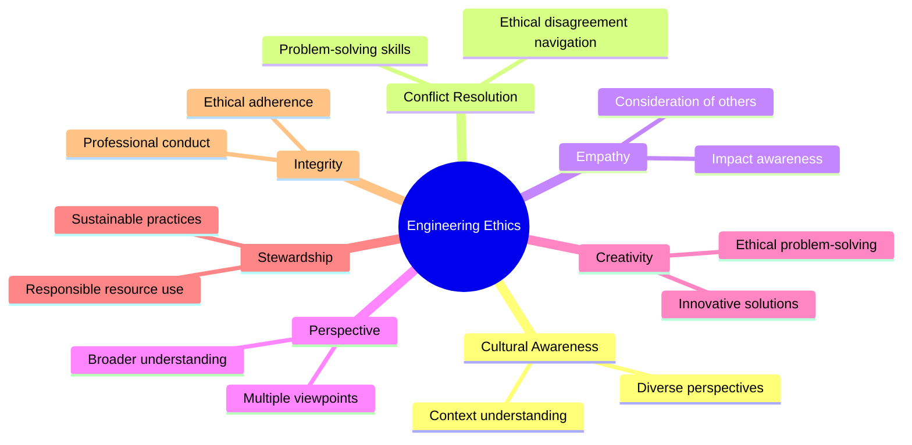

# Engineering Ethics and Responsibility

<!-- How would you summarize what you learned about ethics, and/or
professional responsibility? What has been your one biggest
takeaway from ENGG 687? Going into your career, how will you
integrate these learnings? -->

::left::

  <a class="text-right" link="https://mermaid.org">Source
<small class=" text-[8px]">(MindMap - Design by me)</small>
  </a>

<!-- - Taking ENGG 687 has significantly broadened my understanding of ethics, particularly in the context of engineering. -->

::right::

<v-clicks depths="1">

- Prior to this course, I had a general grasp of ethics, but I now appreciate the applications within the engineering profession.
- My biggest takeaway from ENGG 687 has been the importance of considering ethical implications in engineering design, especially the concepts of 'design for ethics' and 'design for equity'.
- I've learned to differentiate between equality and equity, understanding that equitable solutions often require tailored approaches rather than one-size-fits-all solutions.
- When approaching design challenges, I'll consider not just the technical aspects but also the ethical implications and how to ensure equitable outcomes.
</v-clicks>
