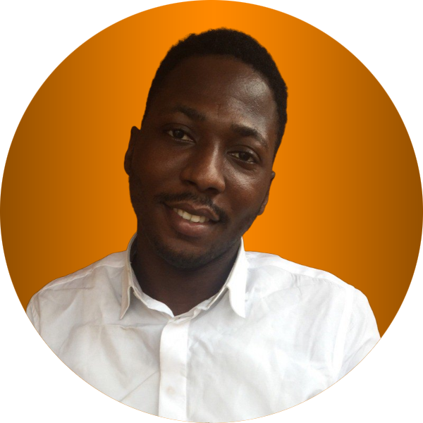

# Introduction

<!-- Who are you? What are your career goals? What strengths do you
bring? What are some examples of your engineering experience?
What have you learned from these? What have been your biggest
challenges? What have been your biggest successes? -->

  

My name is  Oluwatoyin Jolaoso, and I am a graduate student in the Geomatics department at the University of Calgary. As an engineer, I am passionate about creating innovative solutions for everyday problems. I find great joy in breaking down complex issues into manageable parts, allowing me to see the bigger picture and develop effective solutions.Professionally, I have experience as a software engineer and an account manager. In this field it has made it easy to bring my ideas into realization faster.
A notable success in my career has been successfully transitioning into the tech industry. Initially daunting, this journey taught me resilience and adaptability. As I often say in Pidgin English, 'everybody go dey alright las las'—meaning that things may seem uncertain at first, but they will work out in the end.

